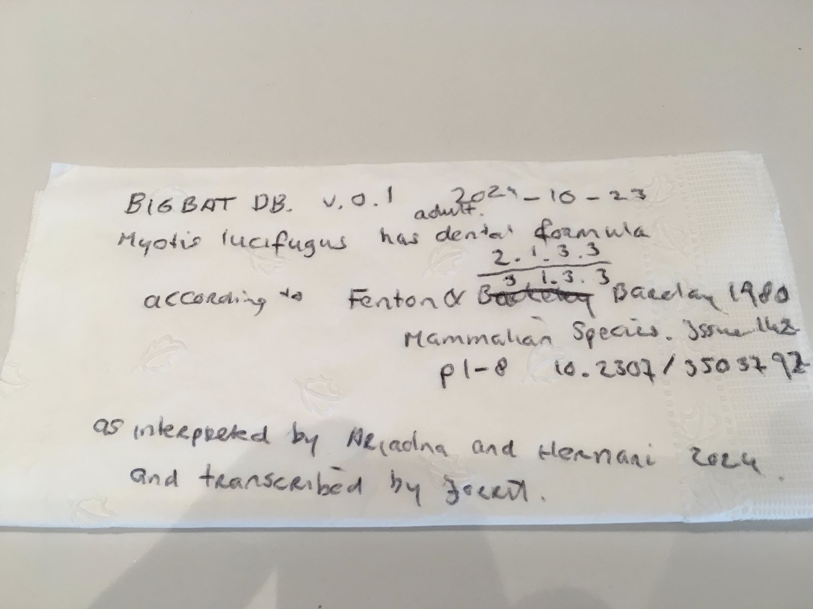

# Big Bat Database

As found in https://www.gbatnet.org/interdisciplinary-projects/#big-bat-database on 2024-10-23

## Cite 

Hernani F. M. Oliveira, Nancy B. Simmons, Cecilia Montauban, and Ariadna E. Morales. Big Bat Database v0.2 https://github.com/bigbatdb/bigbatdb hash://md5/e4cacbacda65381907eeabcad8af6272

## Description
Bring together existing databases for traits (morphology, functional traits, life history traits, acoustics, behavior, genomics, habitat requirements, parasites, pathogens, population sizes, etc.) into one large global database that can underpin many different projects and use this database to answer questions about drivers of diversification, extinction, conservation, disease dynamics, evolution of traits, etc.

## Goals
To set number of traits populated across many species.
To gather as much data ad possible, identify the gap and develop guidelines for data collection.
To have fully documented data in some structure in a central database.

## History

| version | number of records | publication date | fingerprint
| --- | --- | --- | --- | 
| v0.1 | 1 | 2024-10-23 | hash://md5/36f6226d43a533da752dd80447a8fb1b |
| v0.2 | 31 | 2024-12-04 | hash://md5/e4cacbacda65381907eeabcad8af6272 |

### v0.2

After consult with [Encyclopedia of Life on data format](https://github.com/bigbatdb/bigbatdb/issues/1) and transcription from [Koopman 1994](https://linker.bio/hash://md5/791d7aef792ee698134b54daddb21eb4) of [BatLit v0.6](https://batlit.org) the following files where generated through in a [google sheet](https://docs.google.com/spreadsheets/d/1xGPXuwEuqEao2ezya7kW2DWixp4pejqVEjKFD1sqG9g/edit?gid=0#gid=0) as tracked via [track.sh](./track.sh). 

 | name | description | 
 | [bigbatdb.tsv](./bigbatdb.tsv) | tab-separated format |
 | [bigbatdb.xlsx](./bigbatdb.xslx) | excel format | 
 | [bigbatdb.csv](./bigbatdb.csv) | comma-separated format |

### v0.1



## Provenance 

```
preston history --algo md5
```

```
<hash://md5/e4cacbacda65381907eeabcad8af6272> <http://www.w3.org/ns/prov#wasDerivedFrom> <hash://md5/63593e17771b630b4fcb0446b9edbad5> .
<hash://md5/63593e17771b630b4fcb0446b9edbad5> <http://www.w3.org/ns/prov#wasDerivedFrom> <hash://md5/36f6226d43a533da752dd80447a8fb1b> .
<urn:uuid:0659a54f-b713-4f86-a917-5be166a14110> <http://purl.org/pav/hasVersion> <hash://md5/36f6226d43a533da752dd80447a8fb1b> .
```

```
preston ls --algo md5
```

```
<https://preston.guoda.bio> <http://www.w3.org/1999/02/22-rdf-syntax-ns#type> <http://www.w3.org/ns/prov#SoftwareAgent> <urn:uuid:d2b329cf-ba87-4289-ab10-780573e64de3> .
<https://preston.guoda.bio> <http://www.w3.org/1999/02/22-rdf-syntax-ns#type> <http://www.w3.org/ns/prov#Agent> <urn:uuid:d2b329cf-ba87-4289-ab10-780573e64de3> .
<https://preston.guoda.bio> <http://purl.org/dc/terms/description> "Preston is a software program that finds, archives and provides access to biodiversity datasets."@en <urn:uuid:d2b329cf-ba87-4289-ab10-780573e64de3> .
<urn:uuid:d2b329cf-ba87-4289-ab10-780573e64de3> <http://www.w3.org/1999/02/22-rdf-syntax-ns#type> <http://www.w3.org/ns/prov#Activity> <urn:uuid:d2b329cf-ba87-4289-ab10-780573e64de3> .
<urn:uuid:d2b329cf-ba87-4289-ab10-780573e64de3> <http://purl.org/dc/terms/description> "A crawl event that discovers biodiversity archives."@en <urn:uuid:d2b329cf-ba87-4289-ab10-780573e64de3> .
<urn:uuid:d2b329cf-ba87-4289-ab10-780573e64de3> <http://www.w3.org/ns/prov#startedAtTime> "2024-12-04T17:34:06.702Z"^^<http://www.w3.org/2001/XMLSchema#dateTime> <urn:uuid:d2b329cf-ba87-4289-ab10-780573e64de3> .
<urn:uuid:d2b329cf-ba87-4289-ab10-780573e64de3> <http://www.w3.org/ns/prov#wasStartedBy> <https://preston.guoda.bio> <urn:uuid:d2b329cf-ba87-4289-ab10-780573e64de3> .
<https://doi.org/10.5281/zenodo.1410543> <http://www.w3.org/ns/prov#usedBy> <urn:uuid:d2b329cf-ba87-4289-ab10-780573e64de3> <urn:uuid:d2b329cf-ba87-4289-ab10-780573e64de3> .
<https://doi.org/10.5281/zenodo.1410543> <http://www.w3.org/1999/02/22-rdf-syntax-ns#type> <http://purl.org/dc/dcmitype/Software> <urn:uuid:d2b329cf-ba87-4289-ab10-780573e64de3> .
<https://doi.org/10.5281/zenodo.1410543> <http://purl.org/dc/terms/bibliographicCitation> "Jorrit Poelen, Icaro Alzuru, & Michael Elliott. 2018-2024. Preston: a biodiversity dataset tracker (Version 0.10.1-SNAPSHOT) [Software]. Zenodo. https://doi.org/10.5281/zenodo.1410543"@en <urn:uuid:d2b329cf-ba87-4289-ab10-780573e64de3> .
<urn:uuid:0659a54f-b713-4f86-a917-5be166a14110> <http://www.w3.org/1999/02/22-rdf-syntax-ns#type> <http://www.w3.org/ns/prov#Entity> <urn:uuid:d2b329cf-ba87-4289-ab10-780573e64de3> .
<urn:uuid:0659a54f-b713-4f86-a917-5be166a14110> <http://purl.org/dc/terms/description> "A biodiversity dataset graph archive."@en <urn:uuid:d2b329cf-ba87-4289-ab10-780573e64de3> .
<hash://md5/63593e17771b630b4fcb0446b9edbad5> <http://www.w3.org/ns/prov#usedBy> <urn:uuid:d2b329cf-ba87-4289-ab10-780573e64de3> <urn:uuid:d2b329cf-ba87-4289-ab10-780573e64de3> .
<hash://md5/d6d7c4558714ba1c558279c01e5ee80f> <http://www.w3.org/ns/prov#wasGeneratedBy> <urn:uuid:d1841bf6-070c-45d8-8dc8-33b0768f9154> <urn:uuid:d1841bf6-070c-45d8-8dc8-33b0768f9154> .
<hash://md5/d6d7c4558714ba1c558279c01e5ee80f> <http://www.w3.org/ns/prov#qualifiedGeneration> <urn:uuid:d1841bf6-070c-45d8-8dc8-33b0768f9154> <urn:uuid:d1841bf6-070c-45d8-8dc8-33b0768f9154> .
<urn:uuid:d1841bf6-070c-45d8-8dc8-33b0768f9154> <http://www.w3.org/ns/prov#generatedAtTime> "2024-12-04T17:34:07.774Z"^^<http://www.w3.org/2001/XMLSchema#dateTime> <urn:uuid:d1841bf6-070c-45d8-8dc8-33b0768f9154> .
<urn:uuid:d1841bf6-070c-45d8-8dc8-33b0768f9154> <http://www.w3.org/1999/02/22-rdf-syntax-ns#type> <http://www.w3.org/ns/prov#Generation> <urn:uuid:d1841bf6-070c-45d8-8dc8-33b0768f9154> .
<urn:uuid:d1841bf6-070c-45d8-8dc8-33b0768f9154> <http://www.w3.org/ns/prov#wasInformedBy> <urn:uuid:d2b329cf-ba87-4289-ab10-780573e64de3> <urn:uuid:d1841bf6-070c-45d8-8dc8-33b0768f9154> .
<urn:uuid:d1841bf6-070c-45d8-8dc8-33b0768f9154> <http://www.w3.org/ns/prov#used> <https://docs.google.com/spreadsheets/d/1xGPXuwEuqEao2ezya7kW2DWixp4pejqVEjKFD1sqG9g/edit?usp=sharing> <urn:uuid:d1841bf6-070c-45d8-8dc8-33b0768f9154> .
<https://docs.google.com/spreadsheets/d/1xGPXuwEuqEao2ezya7kW2DWixp4pejqVEjKFD1sqG9g/edit?usp=sharing> <http://purl.org/pav/hasVersion> <hash://md5/d6d7c4558714ba1c558279c01e5ee80f> <urn:uuid:d1841bf6-070c-45d8-8dc8-33b0768f9154> .
<https://docs.google.com/spreadsheets/u/0/export?id=1xGPXuwEuqEao2ezya7kW2DWixp4pejqVEjKFD1sqG9g&format=xlsx> <http://www.w3.org/ns/prov#wasDerivedFrom> <https://docs.google.com/spreadsheets/d/1xGPXuwEuqEao2ezya7kW2DWixp4pejqVEjKFD1sqG9g/edit?usp=sharing> .
<https://docs.google.com/spreadsheets/u/0/export?id=1xGPXuwEuqEao2ezya7kW2DWixp4pejqVEjKFD1sqG9g&format=xlsx> <http://purl.org/dc/elements/1.1/format> "application/vnd.openxmlformats-officedocument.spreadsheetml.sheet" .
<hash://md5/014a4d278fe9aa85e96d1680e32552c6> <http://www.w3.org/ns/prov#wasGeneratedBy> <urn:uuid:247a366d-31a0-49dc-8d89-eb22ce247f02> <urn:uuid:247a366d-31a0-49dc-8d89-eb22ce247f02> .
<hash://md5/014a4d278fe9aa85e96d1680e32552c6> <http://www.w3.org/ns/prov#qualifiedGeneration> <urn:uuid:247a366d-31a0-49dc-8d89-eb22ce247f02> <urn:uuid:247a366d-31a0-49dc-8d89-eb22ce247f02> .
<urn:uuid:247a366d-31a0-49dc-8d89-eb22ce247f02> <http://www.w3.org/ns/prov#generatedAtTime> "2024-12-04T17:34:08.922Z"^^<http://www.w3.org/2001/XMLSchema#dateTime> <urn:uuid:247a366d-31a0-49dc-8d89-eb22ce247f02> .
<urn:uuid:247a366d-31a0-49dc-8d89-eb22ce247f02> <http://www.w3.org/1999/02/22-rdf-syntax-ns#type> <http://www.w3.org/ns/prov#Generation> <urn:uuid:247a366d-31a0-49dc-8d89-eb22ce247f02> .
<urn:uuid:247a366d-31a0-49dc-8d89-eb22ce247f02> <http://www.w3.org/ns/prov#used> <https://docs.google.com/spreadsheets/u/0/export?id=1xGPXuwEuqEao2ezya7kW2DWixp4pejqVEjKFD1sqG9g&format=xlsx> <urn:uuid:247a366d-31a0-49dc-8d89-eb22ce247f02> .
<https://docs.google.com/spreadsheets/u/0/export?id=1xGPXuwEuqEao2ezya7kW2DWixp4pejqVEjKFD1sqG9g&format=xlsx> <http://purl.org/pav/hasVersion> <hash://md5/014a4d278fe9aa85e96d1680e32552c6> <urn:uuid:247a366d-31a0-49dc-8d89-eb22ce247f02> .
<https://docs.google.com/spreadsheets/u/0/export?id=1xGPXuwEuqEao2ezya7kW2DWixp4pejqVEjKFD1sqG9g&format=ods> <http://www.w3.org/ns/prov#wasDerivedFrom> <https://docs.google.com/spreadsheets/d/1xGPXuwEuqEao2ezya7kW2DWixp4pejqVEjKFD1sqG9g/edit?usp=sharing> .
<https://docs.google.com/spreadsheets/u/0/export?id=1xGPXuwEuqEao2ezya7kW2DWixp4pejqVEjKFD1sqG9g&format=ods> <http://purl.org/dc/elements/1.1/format> "application/vnd.oasis.opendocument.spreadsheet" .
<hash://md5/1356857668a62a859e004820b5433f98> <http://www.w3.org/ns/prov#wasGeneratedBy> <urn:uuid:637ec100-04d3-4ec1-97c9-6fbb1c56d093> <urn:uuid:637ec100-04d3-4ec1-97c9-6fbb1c56d093> .
<hash://md5/1356857668a62a859e004820b5433f98> <http://www.w3.org/ns/prov#qualifiedGeneration> <urn:uuid:637ec100-04d3-4ec1-97c9-6fbb1c56d093> <urn:uuid:637ec100-04d3-4ec1-97c9-6fbb1c56d093> .
<urn:uuid:637ec100-04d3-4ec1-97c9-6fbb1c56d093> <http://www.w3.org/ns/prov#generatedAtTime> "2024-12-04T17:34:12.211Z"^^<http://www.w3.org/2001/XMLSchema#dateTime> <urn:uuid:637ec100-04d3-4ec1-97c9-6fbb1c56d093> .
<urn:uuid:637ec100-04d3-4ec1-97c9-6fbb1c56d093> <http://www.w3.org/1999/02/22-rdf-syntax-ns#type> <http://www.w3.org/ns/prov#Generation> <urn:uuid:637ec100-04d3-4ec1-97c9-6fbb1c56d093> .
<urn:uuid:637ec100-04d3-4ec1-97c9-6fbb1c56d093> <http://www.w3.org/ns/prov#used> <https://docs.google.com/spreadsheets/u/0/export?id=1xGPXuwEuqEao2ezya7kW2DWixp4pejqVEjKFD1sqG9g&format=ods> <urn:uuid:637ec100-04d3-4ec1-97c9-6fbb1c56d093> .
<https://docs.google.com/spreadsheets/u/0/export?id=1xGPXuwEuqEao2ezya7kW2DWixp4pejqVEjKFD1sqG9g&format=ods> <http://purl.org/pav/hasVersion> <hash://md5/1356857668a62a859e004820b5433f98> <urn:uuid:637ec100-04d3-4ec1-97c9-6fbb1c56d093> .
<https://docs.google.com/spreadsheets/u/0/export?id=1xGPXuwEuqEao2ezya7kW2DWixp4pejqVEjKFD1sqG9g&format=pdf> <http://www.w3.org/ns/prov#wasDerivedFrom> <https://docs.google.com/spreadsheets/d/1xGPXuwEuqEao2ezya7kW2DWixp4pejqVEjKFD1sqG9g/edit?usp=sharing> .
<https://docs.google.com/spreadsheets/u/0/export?id=1xGPXuwEuqEao2ezya7kW2DWixp4pejqVEjKFD1sqG9g&format=pdf> <http://purl.org/dc/elements/1.1/format> "application/pdf" .
<hash://md5/5416063737903970629db1d1d05ac824> <http://www.w3.org/ns/prov#wasGeneratedBy> <urn:uuid:fcc69cb2-9fcd-4680-84fb-a8f97e6b0694> <urn:uuid:fcc69cb2-9fcd-4680-84fb-a8f97e6b0694> .
<hash://md5/5416063737903970629db1d1d05ac824> <http://www.w3.org/ns/prov#qualifiedGeneration> <urn:uuid:fcc69cb2-9fcd-4680-84fb-a8f97e6b0694> <urn:uuid:fcc69cb2-9fcd-4680-84fb-a8f97e6b0694> .
<urn:uuid:fcc69cb2-9fcd-4680-84fb-a8f97e6b0694> <http://www.w3.org/ns/prov#generatedAtTime> "2024-12-04T17:34:12.977Z"^^<http://www.w3.org/2001/XMLSchema#dateTime> <urn:uuid:fcc69cb2-9fcd-4680-84fb-a8f97e6b0694> .
<urn:uuid:fcc69cb2-9fcd-4680-84fb-a8f97e6b0694> <http://www.w3.org/1999/02/22-rdf-syntax-ns#type> <http://www.w3.org/ns/prov#Generation> <urn:uuid:fcc69cb2-9fcd-4680-84fb-a8f97e6b0694> .
<urn:uuid:fcc69cb2-9fcd-4680-84fb-a8f97e6b0694> <http://www.w3.org/ns/prov#used> <https://docs.google.com/spreadsheets/u/0/export?id=1xGPXuwEuqEao2ezya7kW2DWixp4pejqVEjKFD1sqG9g&format=pdf> <urn:uuid:fcc69cb2-9fcd-4680-84fb-a8f97e6b0694> .
<https://docs.google.com/spreadsheets/u/0/export?id=1xGPXuwEuqEao2ezya7kW2DWixp4pejqVEjKFD1sqG9g&format=pdf> <http://purl.org/pav/hasVersion> <hash://md5/5416063737903970629db1d1d05ac824> <urn:uuid:fcc69cb2-9fcd-4680-84fb-a8f97e6b0694> .
<https://docs.google.com/spreadsheets/u/0/export?id=1xGPXuwEuqEao2ezya7kW2DWixp4pejqVEjKFD1sqG9g&format=csv> <http://www.w3.org/ns/prov#wasDerivedFrom> <https://docs.google.com/spreadsheets/d/1xGPXuwEuqEao2ezya7kW2DWixp4pejqVEjKFD1sqG9g/edit?usp=sharing> .
<https://docs.google.com/spreadsheets/u/0/export?id=1xGPXuwEuqEao2ezya7kW2DWixp4pejqVEjKFD1sqG9g&format=csv> <http://purl.org/dc/elements/1.1/format> "text/csv" .
<hash://md5/6494eebfb6c82e30a3b71e597cc929de> <http://www.w3.org/ns/prov#wasGeneratedBy> <urn:uuid:485016e7-1bb1-432c-b378-69a134ceca83> <urn:uuid:485016e7-1bb1-432c-b378-69a134ceca83> .
<hash://md5/6494eebfb6c82e30a3b71e597cc929de> <http://www.w3.org/ns/prov#qualifiedGeneration> <urn:uuid:485016e7-1bb1-432c-b378-69a134ceca83> <urn:uuid:485016e7-1bb1-432c-b378-69a134ceca83> .
<urn:uuid:485016e7-1bb1-432c-b378-69a134ceca83> <http://www.w3.org/ns/prov#generatedAtTime> "2024-12-04T17:34:13.483Z"^^<http://www.w3.org/2001/XMLSchema#dateTime> <urn:uuid:485016e7-1bb1-432c-b378-69a134ceca83> .
<urn:uuid:485016e7-1bb1-432c-b378-69a134ceca83> <http://www.w3.org/1999/02/22-rdf-syntax-ns#type> <http://www.w3.org/ns/prov#Generation> <urn:uuid:485016e7-1bb1-432c-b378-69a134ceca83> .
<urn:uuid:485016e7-1bb1-432c-b378-69a134ceca83> <http://www.w3.org/ns/prov#used> <https://docs.google.com/spreadsheets/u/0/export?id=1xGPXuwEuqEao2ezya7kW2DWixp4pejqVEjKFD1sqG9g&format=csv> <urn:uuid:485016e7-1bb1-432c-b378-69a134ceca83> .
<https://docs.google.com/spreadsheets/u/0/export?id=1xGPXuwEuqEao2ezya7kW2DWixp4pejqVEjKFD1sqG9g&format=csv> <http://purl.org/pav/hasVersion> <hash://md5/6494eebfb6c82e30a3b71e597cc929de> <urn:uuid:485016e7-1bb1-432c-b378-69a134ceca83> .
<https://docs.google.com/spreadsheets/u/0/export?id=1xGPXuwEuqEao2ezya7kW2DWixp4pejqVEjKFD1sqG9g&format=tsv> <http://www.w3.org/ns/prov#wasDerivedFrom> <https://docs.google.com/spreadsheets/d/1xGPXuwEuqEao2ezya7kW2DWixp4pejqVEjKFD1sqG9g/edit?usp=sharing> .
<https://docs.google.com/spreadsheets/u/0/export?id=1xGPXuwEuqEao2ezya7kW2DWixp4pejqVEjKFD1sqG9g&format=tsv> <http://purl.org/dc/elements/1.1/format> "text/tab-separated-values" .
<hash://md5/fa07abc0f3d3ce61b5a4eb93a97207ab> <http://www.w3.org/ns/prov#wasGeneratedBy> <urn:uuid:58819af4-0cef-44c8-97c4-3c6862735852> <urn:uuid:58819af4-0cef-44c8-97c4-3c6862735852> .
<hash://md5/fa07abc0f3d3ce61b5a4eb93a97207ab> <http://www.w3.org/ns/prov#qualifiedGeneration> <urn:uuid:58819af4-0cef-44c8-97c4-3c6862735852> <urn:uuid:58819af4-0cef-44c8-97c4-3c6862735852> .
<urn:uuid:58819af4-0cef-44c8-97c4-3c6862735852> <http://www.w3.org/ns/prov#generatedAtTime> "2024-12-04T17:34:14.242Z"^^<http://www.w3.org/2001/XMLSchema#dateTime> <urn:uuid:58819af4-0cef-44c8-97c4-3c6862735852> .
<urn:uuid:58819af4-0cef-44c8-97c4-3c6862735852> <http://www.w3.org/1999/02/22-rdf-syntax-ns#type> <http://www.w3.org/ns/prov#Generation> <urn:uuid:58819af4-0cef-44c8-97c4-3c6862735852> .
<urn:uuid:58819af4-0cef-44c8-97c4-3c6862735852> <http://www.w3.org/ns/prov#used> <https://docs.google.com/spreadsheets/u/0/export?id=1xGPXuwEuqEao2ezya7kW2DWixp4pejqVEjKFD1sqG9g&format=tsv> <urn:uuid:58819af4-0cef-44c8-97c4-3c6862735852> .
<https://docs.google.com/spreadsheets/u/0/export?id=1xGPXuwEuqEao2ezya7kW2DWixp4pejqVEjKFD1sqG9g&format=tsv> <http://purl.org/pav/hasVersion> <hash://md5/fa07abc0f3d3ce61b5a4eb93a97207ab> <urn:uuid:58819af4-0cef-44c8-97c4-3c6862735852> .
<https://docs.google.com/spreadsheets/u/0/export?id=1xGPXuwEuqEao2ezya7kW2DWixp4pejqVEjKFD1sqG9g&format=zip> <http://www.w3.org/ns/prov#wasDerivedFrom> <https://docs.google.com/spreadsheets/d/1xGPXuwEuqEao2ezya7kW2DWixp4pejqVEjKFD1sqG9g/edit?usp=sharing> .
<https://docs.google.com/spreadsheets/u/0/export?id=1xGPXuwEuqEao2ezya7kW2DWixp4pejqVEjKFD1sqG9g&format=zip> <http://purl.org/dc/elements/1.1/format> "application/zip" .
<hash://md5/176d860ac73b4ede06cf9a0a3bf1511f> <http://www.w3.org/ns/prov#wasGeneratedBy> <urn:uuid:4cc40b83-0dc1-4a25-9180-66a597a45c29> <urn:uuid:4cc40b83-0dc1-4a25-9180-66a597a45c29> .
<hash://md5/176d860ac73b4ede06cf9a0a3bf1511f> <http://www.w3.org/ns/prov#qualifiedGeneration> <urn:uuid:4cc40b83-0dc1-4a25-9180-66a597a45c29> <urn:uuid:4cc40b83-0dc1-4a25-9180-66a597a45c29> .
<urn:uuid:4cc40b83-0dc1-4a25-9180-66a597a45c29> <http://www.w3.org/ns/prov#generatedAtTime> "2024-12-04T17:34:15.081Z"^^<http://www.w3.org/2001/XMLSchema#dateTime> <urn:uuid:4cc40b83-0dc1-4a25-9180-66a597a45c29> .
<urn:uuid:4cc40b83-0dc1-4a25-9180-66a597a45c29> <http://www.w3.org/1999/02/22-rdf-syntax-ns#type> <http://www.w3.org/ns/prov#Generation> <urn:uuid:4cc40b83-0dc1-4a25-9180-66a597a45c29> .
<urn:uuid:4cc40b83-0dc1-4a25-9180-66a597a45c29> <http://www.w3.org/ns/prov#used> <https://docs.google.com/spreadsheets/u/0/export?id=1xGPXuwEuqEao2ezya7kW2DWixp4pejqVEjKFD1sqG9g&format=zip> <urn:uuid:4cc40b83-0dc1-4a25-9180-66a597a45c29> .
<https://docs.google.com/spreadsheets/u/0/export?id=1xGPXuwEuqEao2ezya7kW2DWixp4pejqVEjKFD1sqG9g&format=zip> <http://purl.org/pav/hasVersion> <hash://md5/176d860ac73b4ede06cf9a0a3bf1511f> <urn:uuid:4cc40b83-0dc1-4a25-9180-66a597a45c29> .
<https://preston.guoda.bio> <http://www.w3.org/1999/02/22-rdf-syntax-ns#type> <http://www.w3.org/ns/prov#SoftwareAgent> <urn:uuid:3028ad53-45bf-4e72-90d4-8c3db520c6f8> .
<https://preston.guoda.bio> <http://www.w3.org/1999/02/22-rdf-syntax-ns#type> <http://www.w3.org/ns/prov#Agent> <urn:uuid:3028ad53-45bf-4e72-90d4-8c3db520c6f8> .
<https://preston.guoda.bio> <http://purl.org/dc/terms/description> "Preston is a software program that finds, archives and provides access to biodiversity datasets."@en <urn:uuid:3028ad53-45bf-4e72-90d4-8c3db520c6f8> .
<urn:uuid:3028ad53-45bf-4e72-90d4-8c3db520c6f8> <http://www.w3.org/1999/02/22-rdf-syntax-ns#type> <http://www.w3.org/ns/prov#Activity> <urn:uuid:3028ad53-45bf-4e72-90d4-8c3db520c6f8> .
<urn:uuid:3028ad53-45bf-4e72-90d4-8c3db520c6f8> <http://purl.org/dc/terms/description> "A crawl event that discovers biodiversity archives."@en <urn:uuid:3028ad53-45bf-4e72-90d4-8c3db520c6f8> .
<urn:uuid:3028ad53-45bf-4e72-90d4-8c3db520c6f8> <http://www.w3.org/ns/prov#startedAtTime> "2024-11-09T22:27:18.521Z"^^<http://www.w3.org/2001/XMLSchema#dateTime> <urn:uuid:3028ad53-45bf-4e72-90d4-8c3db520c6f8> .
<urn:uuid:3028ad53-45bf-4e72-90d4-8c3db520c6f8> <http://www.w3.org/ns/prov#wasStartedBy> <https://preston.guoda.bio> <urn:uuid:3028ad53-45bf-4e72-90d4-8c3db520c6f8> .
<https://doi.org/10.5281/zenodo.1410543> <http://www.w3.org/ns/prov#usedBy> <urn:uuid:3028ad53-45bf-4e72-90d4-8c3db520c6f8> <urn:uuid:3028ad53-45bf-4e72-90d4-8c3db520c6f8> .
<https://doi.org/10.5281/zenodo.1410543> <http://www.w3.org/1999/02/22-rdf-syntax-ns#type> <http://purl.org/dc/dcmitype/Software> <urn:uuid:3028ad53-45bf-4e72-90d4-8c3db520c6f8> .
<https://doi.org/10.5281/zenodo.1410543> <http://purl.org/dc/terms/bibliographicCitation> "Jorrit Poelen, Icaro Alzuru, & Michael Elliott. 2018-2024. Preston: a biodiversity dataset tracker (Version 0.10.1-SNAPSHOT) [Software]. Zenodo. https://doi.org/10.5281/zenodo.1410543"@en <urn:uuid:3028ad53-45bf-4e72-90d4-8c3db520c6f8> .
<urn:uuid:0659a54f-b713-4f86-a917-5be166a14110> <http://www.w3.org/1999/02/22-rdf-syntax-ns#type> <http://www.w3.org/ns/prov#Entity> <urn:uuid:3028ad53-45bf-4e72-90d4-8c3db520c6f8> .
<urn:uuid:0659a54f-b713-4f86-a917-5be166a14110> <http://purl.org/dc/terms/description> "A biodiversity dataset graph archive."@en <urn:uuid:3028ad53-45bf-4e72-90d4-8c3db520c6f8> .
<hash://md5/36f6226d43a533da752dd80447a8fb1b> <http://www.w3.org/ns/prov#usedBy> <urn:uuid:3028ad53-45bf-4e72-90d4-8c3db520c6f8> <urn:uuid:3028ad53-45bf-4e72-90d4-8c3db520c6f8> .
<hash://md5/944f3e79ee5dd8cf49daf1257a65f624> <http://www.w3.org/ns/prov#wasGeneratedBy> <urn:uuid:ec639df3-4299-47a6-be9c-38951c04e54d> <urn:uuid:ec639df3-4299-47a6-be9c-38951c04e54d> .
<hash://md5/944f3e79ee5dd8cf49daf1257a65f624> <http://www.w3.org/ns/prov#qualifiedGeneration> <urn:uuid:ec639df3-4299-47a6-be9c-38951c04e54d> <urn:uuid:ec639df3-4299-47a6-be9c-38951c04e54d> .
<urn:uuid:ec639df3-4299-47a6-be9c-38951c04e54d> <http://www.w3.org/ns/prov#generatedAtTime> "2024-11-09T22:27:19.984Z"^^<http://www.w3.org/2001/XMLSchema#dateTime> <urn:uuid:ec639df3-4299-47a6-be9c-38951c04e54d> .
<urn:uuid:ec639df3-4299-47a6-be9c-38951c04e54d> <http://www.w3.org/1999/02/22-rdf-syntax-ns#type> <http://www.w3.org/ns/prov#Generation> <urn:uuid:ec639df3-4299-47a6-be9c-38951c04e54d> .
<urn:uuid:ec639df3-4299-47a6-be9c-38951c04e54d> <http://www.w3.org/ns/prov#wasInformedBy> <urn:uuid:3028ad53-45bf-4e72-90d4-8c3db520c6f8> <urn:uuid:ec639df3-4299-47a6-be9c-38951c04e54d> .
<urn:uuid:ec639df3-4299-47a6-be9c-38951c04e54d> <http://www.w3.org/ns/prov#used> <https://docs.google.com/spreadsheets/d/1gtENmce4tv2AJWduWrj6dKnDFE0O-tLNZVAG6BAn5r4/edit?gid=0#gid=0> <urn:uuid:ec639df3-4299-47a6-be9c-38951c04e54d> .
<https://docs.google.com/spreadsheets/d/1gtENmce4tv2AJWduWrj6dKnDFE0O-tLNZVAG6BAn5r4/edit?gid=0#gid=0> <http://purl.org/pav/hasVersion> <hash://md5/944f3e79ee5dd8cf49daf1257a65f624> <urn:uuid:ec639df3-4299-47a6-be9c-38951c04e54d> .
<https://docs.google.com/spreadsheets/u/0/export?id=1gtENmce4tv2AJWduWrj6dKnDFE0O-tLNZVAG6BAn5r4&format=xlsx> <http://www.w3.org/ns/prov#wasDerivedFrom> <https://docs.google.com/spreadsheets/d/1gtENmce4tv2AJWduWrj6dKnDFE0O-tLNZVAG6BAn5r4/edit?gid=0#gid=0> .
<https://docs.google.com/spreadsheets/u/0/export?id=1gtENmce4tv2AJWduWrj6dKnDFE0O-tLNZVAG6BAn5r4&format=xlsx> <http://purl.org/dc/elements/1.1/format> "application/vnd.openxmlformats-officedocument.spreadsheetml.sheet" .
<hash://md5/d49b5f4a59495c1b2b10f524fe403414> <http://www.w3.org/ns/prov#wasGeneratedBy> <urn:uuid:b59729f3-13eb-426a-a0a3-31605d8f26d6> <urn:uuid:b59729f3-13eb-426a-a0a3-31605d8f26d6> .
<hash://md5/d49b5f4a59495c1b2b10f524fe403414> <http://www.w3.org/ns/prov#qualifiedGeneration> <urn:uuid:b59729f3-13eb-426a-a0a3-31605d8f26d6> <urn:uuid:b59729f3-13eb-426a-a0a3-31605d8f26d6> .
<urn:uuid:b59729f3-13eb-426a-a0a3-31605d8f26d6> <http://www.w3.org/ns/prov#generatedAtTime> "2024-11-09T22:27:21.013Z"^^<http://www.w3.org/2001/XMLSchema#dateTime> <urn:uuid:b59729f3-13eb-426a-a0a3-31605d8f26d6> .
<urn:uuid:b59729f3-13eb-426a-a0a3-31605d8f26d6> <http://www.w3.org/1999/02/22-rdf-syntax-ns#type> <http://www.w3.org/ns/prov#Generation> <urn:uuid:b59729f3-13eb-426a-a0a3-31605d8f26d6> .
<urn:uuid:b59729f3-13eb-426a-a0a3-31605d8f26d6> <http://www.w3.org/ns/prov#used> <https://docs.google.com/spreadsheets/u/0/export?id=1gtENmce4tv2AJWduWrj6dKnDFE0O-tLNZVAG6BAn5r4&format=xlsx> <urn:uuid:b59729f3-13eb-426a-a0a3-31605d8f26d6> .
<https://docs.google.com/spreadsheets/u/0/export?id=1gtENmce4tv2AJWduWrj6dKnDFE0O-tLNZVAG6BAn5r4&format=xlsx> <http://purl.org/pav/hasVersion> <hash://md5/d49b5f4a59495c1b2b10f524fe403414> <urn:uuid:b59729f3-13eb-426a-a0a3-31605d8f26d6> .
<https://docs.google.com/spreadsheets/u/0/export?id=1gtENmce4tv2AJWduWrj6dKnDFE0O-tLNZVAG6BAn5r4&format=ods> <http://www.w3.org/ns/prov#wasDerivedFrom> <https://docs.google.com/spreadsheets/d/1gtENmce4tv2AJWduWrj6dKnDFE0O-tLNZVAG6BAn5r4/edit?gid=0#gid=0> .
<https://docs.google.com/spreadsheets/u/0/export?id=1gtENmce4tv2AJWduWrj6dKnDFE0O-tLNZVAG6BAn5r4&format=ods> <http://purl.org/dc/elements/1.1/format> "application/vnd.oasis.opendocument.spreadsheet" .
<hash://md5/ddb4ed302d89cb5553d81b659fc82023> <http://www.w3.org/ns/prov#wasGeneratedBy> <urn:uuid:fc15f5fc-fb21-436d-a568-066db56681e6> <urn:uuid:fc15f5fc-fb21-436d-a568-066db56681e6> .
<hash://md5/ddb4ed302d89cb5553d81b659fc82023> <http://www.w3.org/ns/prov#qualifiedGeneration> <urn:uuid:fc15f5fc-fb21-436d-a568-066db56681e6> <urn:uuid:fc15f5fc-fb21-436d-a568-066db56681e6> .
<urn:uuid:fc15f5fc-fb21-436d-a568-066db56681e6> <http://www.w3.org/ns/prov#generatedAtTime> "2024-11-09T22:27:24.211Z"^^<http://www.w3.org/2001/XMLSchema#dateTime> <urn:uuid:fc15f5fc-fb21-436d-a568-066db56681e6> .
<urn:uuid:fc15f5fc-fb21-436d-a568-066db56681e6> <http://www.w3.org/1999/02/22-rdf-syntax-ns#type> <http://www.w3.org/ns/prov#Generation> <urn:uuid:fc15f5fc-fb21-436d-a568-066db56681e6> .
<urn:uuid:fc15f5fc-fb21-436d-a568-066db56681e6> <http://www.w3.org/ns/prov#used> <https://docs.google.com/spreadsheets/u/0/export?id=1gtENmce4tv2AJWduWrj6dKnDFE0O-tLNZVAG6BAn5r4&format=ods> <urn:uuid:fc15f5fc-fb21-436d-a568-066db56681e6> .
<https://docs.google.com/spreadsheets/u/0/export?id=1gtENmce4tv2AJWduWrj6dKnDFE0O-tLNZVAG6BAn5r4&format=ods> <http://purl.org/pav/hasVersion> <hash://md5/ddb4ed302d89cb5553d81b659fc82023> <urn:uuid:fc15f5fc-fb21-436d-a568-066db56681e6> .
<https://docs.google.com/spreadsheets/u/0/export?id=1gtENmce4tv2AJWduWrj6dKnDFE0O-tLNZVAG6BAn5r4&format=pdf> <http://www.w3.org/ns/prov#wasDerivedFrom> <https://docs.google.com/spreadsheets/d/1gtENmce4tv2AJWduWrj6dKnDFE0O-tLNZVAG6BAn5r4/edit?gid=0#gid=0> .
<https://docs.google.com/spreadsheets/u/0/export?id=1gtENmce4tv2AJWduWrj6dKnDFE0O-tLNZVAG6BAn5r4&format=pdf> <http://purl.org/dc/elements/1.1/format> "application/pdf" .
<hash://md5/673d29ed8769c80a0fede366786132e5> <http://www.w3.org/ns/prov#wasGeneratedBy> <urn:uuid:c99eb3dd-73e4-418d-a430-f637186f208d> <urn:uuid:c99eb3dd-73e4-418d-a430-f637186f208d> .
<hash://md5/673d29ed8769c80a0fede366786132e5> <http://www.w3.org/ns/prov#qualifiedGeneration> <urn:uuid:c99eb3dd-73e4-418d-a430-f637186f208d> <urn:uuid:c99eb3dd-73e4-418d-a430-f637186f208d> .
<urn:uuid:c99eb3dd-73e4-418d-a430-f637186f208d> <http://www.w3.org/ns/prov#generatedAtTime> "2024-11-09T22:27:24.742Z"^^<http://www.w3.org/2001/XMLSchema#dateTime> <urn:uuid:c99eb3dd-73e4-418d-a430-f637186f208d> .
<urn:uuid:c99eb3dd-73e4-418d-a430-f637186f208d> <http://www.w3.org/1999/02/22-rdf-syntax-ns#type> <http://www.w3.org/ns/prov#Generation> <urn:uuid:c99eb3dd-73e4-418d-a430-f637186f208d> .
<urn:uuid:c99eb3dd-73e4-418d-a430-f637186f208d> <http://www.w3.org/ns/prov#used> <https://docs.google.com/spreadsheets/u/0/export?id=1gtENmce4tv2AJWduWrj6dKnDFE0O-tLNZVAG6BAn5r4&format=pdf> <urn:uuid:c99eb3dd-73e4-418d-a430-f637186f208d> .
<https://docs.google.com/spreadsheets/u/0/export?id=1gtENmce4tv2AJWduWrj6dKnDFE0O-tLNZVAG6BAn5r4&format=pdf> <http://purl.org/pav/hasVersion> <hash://md5/673d29ed8769c80a0fede366786132e5> <urn:uuid:c99eb3dd-73e4-418d-a430-f637186f208d> .
<https://docs.google.com/spreadsheets/u/0/export?id=1gtENmce4tv2AJWduWrj6dKnDFE0O-tLNZVAG6BAn5r4&gid=0&format=csv> <http://www.w3.org/ns/prov#wasDerivedFrom> <https://docs.google.com/spreadsheets/d/1gtENmce4tv2AJWduWrj6dKnDFE0O-tLNZVAG6BAn5r4/edit?gid=0#gid=0> .
<https://docs.google.com/spreadsheets/u/0/export?id=1gtENmce4tv2AJWduWrj6dKnDFE0O-tLNZVAG6BAn5r4&gid=0&format=csv> <http://purl.org/dc/elements/1.1/format> "text/csv" .
<hash://md5/818fa99b3bc7e8281b576ce4ba845007> <http://www.w3.org/ns/prov#wasGeneratedBy> <urn:uuid:d50902c3-392f-494b-9c47-68a4ac36dc42> <urn:uuid:d50902c3-392f-494b-9c47-68a4ac36dc42> .
<hash://md5/818fa99b3bc7e8281b576ce4ba845007> <http://www.w3.org/ns/prov#qualifiedGeneration> <urn:uuid:d50902c3-392f-494b-9c47-68a4ac36dc42> <urn:uuid:d50902c3-392f-494b-9c47-68a4ac36dc42> .
<urn:uuid:d50902c3-392f-494b-9c47-68a4ac36dc42> <http://www.w3.org/ns/prov#generatedAtTime> "2024-11-09T22:27:25.225Z"^^<http://www.w3.org/2001/XMLSchema#dateTime> <urn:uuid:d50902c3-392f-494b-9c47-68a4ac36dc42> .
<urn:uuid:d50902c3-392f-494b-9c47-68a4ac36dc42> <http://www.w3.org/1999/02/22-rdf-syntax-ns#type> <http://www.w3.org/ns/prov#Generation> <urn:uuid:d50902c3-392f-494b-9c47-68a4ac36dc42> .
<urn:uuid:d50902c3-392f-494b-9c47-68a4ac36dc42> <http://www.w3.org/ns/prov#used> <https://docs.google.com/spreadsheets/u/0/export?id=1gtENmce4tv2AJWduWrj6dKnDFE0O-tLNZVAG6BAn5r4&gid=0&format=csv> <urn:uuid:d50902c3-392f-494b-9c47-68a4ac36dc42> .
<https://docs.google.com/spreadsheets/u/0/export?id=1gtENmce4tv2AJWduWrj6dKnDFE0O-tLNZVAG6BAn5r4&gid=0&format=csv> <http://purl.org/pav/hasVersion> <hash://md5/818fa99b3bc7e8281b576ce4ba845007> <urn:uuid:d50902c3-392f-494b-9c47-68a4ac36dc42> .
<https://docs.google.com/spreadsheets/u/0/export?id=1gtENmce4tv2AJWduWrj6dKnDFE0O-tLNZVAG6BAn5r4&gid=0&format=tsv> <http://www.w3.org/ns/prov#wasDerivedFrom> <https://docs.google.com/spreadsheets/d/1gtENmce4tv2AJWduWrj6dKnDFE0O-tLNZVAG6BAn5r4/edit?gid=0#gid=0> .
<https://docs.google.com/spreadsheets/u/0/export?id=1gtENmce4tv2AJWduWrj6dKnDFE0O-tLNZVAG6BAn5r4&gid=0&format=tsv> <http://purl.org/dc/elements/1.1/format> "text/tab-separated-values" .
<hash://md5/e76b9be88c8b4c7b9cf34474d31d6130> <http://www.w3.org/ns/prov#wasGeneratedBy> <urn:uuid:07da686d-ef3b-43aa-b937-2ab3fdb456bc> <urn:uuid:07da686d-ef3b-43aa-b937-2ab3fdb456bc> .
<hash://md5/e76b9be88c8b4c7b9cf34474d31d6130> <http://www.w3.org/ns/prov#qualifiedGeneration> <urn:uuid:07da686d-ef3b-43aa-b937-2ab3fdb456bc> <urn:uuid:07da686d-ef3b-43aa-b937-2ab3fdb456bc> .
<urn:uuid:07da686d-ef3b-43aa-b937-2ab3fdb456bc> <http://www.w3.org/ns/prov#generatedAtTime> "2024-11-09T22:27:25.696Z"^^<http://www.w3.org/2001/XMLSchema#dateTime> <urn:uuid:07da686d-ef3b-43aa-b937-2ab3fdb456bc> .
<urn:uuid:07da686d-ef3b-43aa-b937-2ab3fdb456bc> <http://www.w3.org/1999/02/22-rdf-syntax-ns#type> <http://www.w3.org/ns/prov#Generation> <urn:uuid:07da686d-ef3b-43aa-b937-2ab3fdb456bc> .
<urn:uuid:07da686d-ef3b-43aa-b937-2ab3fdb456bc> <http://www.w3.org/ns/prov#used> <https://docs.google.com/spreadsheets/u/0/export?id=1gtENmce4tv2AJWduWrj6dKnDFE0O-tLNZVAG6BAn5r4&gid=0&format=tsv> <urn:uuid:07da686d-ef3b-43aa-b937-2ab3fdb456bc> .
<https://docs.google.com/spreadsheets/u/0/export?id=1gtENmce4tv2AJWduWrj6dKnDFE0O-tLNZVAG6BAn5r4&gid=0&format=tsv> <http://purl.org/pav/hasVersion> <hash://md5/e76b9be88c8b4c7b9cf34474d31d6130> <urn:uuid:07da686d-ef3b-43aa-b937-2ab3fdb456bc> .
<https://docs.google.com/spreadsheets/u/0/export?id=1gtENmce4tv2AJWduWrj6dKnDFE0O-tLNZVAG6BAn5r4&format=zip> <http://www.w3.org/ns/prov#wasDerivedFrom> <https://docs.google.com/spreadsheets/d/1gtENmce4tv2AJWduWrj6dKnDFE0O-tLNZVAG6BAn5r4/edit?gid=0#gid=0> .
<https://docs.google.com/spreadsheets/u/0/export?id=1gtENmce4tv2AJWduWrj6dKnDFE0O-tLNZVAG6BAn5r4&format=zip> <http://purl.org/dc/elements/1.1/format> "application/zip" .
<hash://md5/24c8387f87564b77013c8f8a189a973c> <http://www.w3.org/ns/prov#wasGeneratedBy> <urn:uuid:4c680bde-13f1-4e38-8508-3f6f7090cd93> <urn:uuid:4c680bde-13f1-4e38-8508-3f6f7090cd93> .
<hash://md5/24c8387f87564b77013c8f8a189a973c> <http://www.w3.org/ns/prov#qualifiedGeneration> <urn:uuid:4c680bde-13f1-4e38-8508-3f6f7090cd93> <urn:uuid:4c680bde-13f1-4e38-8508-3f6f7090cd93> .
<urn:uuid:4c680bde-13f1-4e38-8508-3f6f7090cd93> <http://www.w3.org/ns/prov#generatedAtTime> "2024-11-09T22:27:26.344Z"^^<http://www.w3.org/2001/XMLSchema#dateTime> <urn:uuid:4c680bde-13f1-4e38-8508-3f6f7090cd93> .
<urn:uuid:4c680bde-13f1-4e38-8508-3f6f7090cd93> <http://www.w3.org/1999/02/22-rdf-syntax-ns#type> <http://www.w3.org/ns/prov#Generation> <urn:uuid:4c680bde-13f1-4e38-8508-3f6f7090cd93> .
<urn:uuid:4c680bde-13f1-4e38-8508-3f6f7090cd93> <http://www.w3.org/ns/prov#used> <https://docs.google.com/spreadsheets/u/0/export?id=1gtENmce4tv2AJWduWrj6dKnDFE0O-tLNZVAG6BAn5r4&format=zip> <urn:uuid:4c680bde-13f1-4e38-8508-3f6f7090cd93> .
<https://docs.google.com/spreadsheets/u/0/export?id=1gtENmce4tv2AJWduWrj6dKnDFE0O-tLNZVAG6BAn5r4&format=zip> <http://purl.org/pav/hasVersion> <hash://md5/24c8387f87564b77013c8f8a189a973c> <urn:uuid:4c680bde-13f1-4e38-8508-3f6f7090cd93> .
<https://preston.guoda.bio> <http://www.w3.org/1999/02/22-rdf-syntax-ns#type> <http://www.w3.org/ns/prov#SoftwareAgent> <urn:uuid:652771d8-a71e-4618-9bfd-dd53d1e90250> .
<https://preston.guoda.bio> <http://www.w3.org/1999/02/22-rdf-syntax-ns#type> <http://www.w3.org/ns/prov#Agent> <urn:uuid:652771d8-a71e-4618-9bfd-dd53d1e90250> .
<https://preston.guoda.bio> <http://purl.org/dc/terms/description> "Preston is a software program that finds, archives and provides access to biodiversity datasets."@en <urn:uuid:652771d8-a71e-4618-9bfd-dd53d1e90250> .
<urn:uuid:652771d8-a71e-4618-9bfd-dd53d1e90250> <http://www.w3.org/1999/02/22-rdf-syntax-ns#type> <http://www.w3.org/ns/prov#Activity> <urn:uuid:652771d8-a71e-4618-9bfd-dd53d1e90250> .
<urn:uuid:652771d8-a71e-4618-9bfd-dd53d1e90250> <http://purl.org/dc/terms/description> "BigBatDB v0.1"@en <urn:uuid:652771d8-a71e-4618-9bfd-dd53d1e90250> .
<urn:uuid:652771d8-a71e-4618-9bfd-dd53d1e90250> <http://www.w3.org/ns/prov#startedAtTime> "2024-10-23T23:42:30.494Z"^^<http://www.w3.org/2001/XMLSchema#dateTime> <urn:uuid:652771d8-a71e-4618-9bfd-dd53d1e90250> .
<urn:uuid:652771d8-a71e-4618-9bfd-dd53d1e90250> <http://www.w3.org/ns/prov#wasStartedBy> <https://preston.guoda.bio> <urn:uuid:652771d8-a71e-4618-9bfd-dd53d1e90250> .
<https://doi.org/10.5281/zenodo.1410543> <http://www.w3.org/ns/prov#usedBy> <urn:uuid:652771d8-a71e-4618-9bfd-dd53d1e90250> <urn:uuid:652771d8-a71e-4618-9bfd-dd53d1e90250> .
<https://doi.org/10.5281/zenodo.1410543> <http://www.w3.org/1999/02/22-rdf-syntax-ns#type> <http://purl.org/dc/dcmitype/Software> <urn:uuid:652771d8-a71e-4618-9bfd-dd53d1e90250> .
<https://doi.org/10.5281/zenodo.1410543> <http://purl.org/dc/terms/bibliographicCitation> "Jorrit Poelen, Icaro Alzuru, & Michael Elliott. 2018-2024. Preston: a biodiversity dataset tracker (Version 0.9.9-SNAPSHOT) [Software]. Zenodo. https://doi.org/10.5281/zenodo.1410543"@en <urn:uuid:652771d8-a71e-4618-9bfd-dd53d1e90250> .
<urn:uuid:0659a54f-b713-4f86-a917-5be166a14110> <http://www.w3.org/1999/02/22-rdf-syntax-ns#type> <http://www.w3.org/ns/prov#Entity> <urn:uuid:652771d8-a71e-4618-9bfd-dd53d1e90250> .
<urn:uuid:0659a54f-b713-4f86-a917-5be166a14110> <http://purl.org/dc/terms/description> "A biodiversity dataset graph archive."@en <urn:uuid:652771d8-a71e-4618-9bfd-dd53d1e90250> .
<hash://md5/2ccd2a31e9cc7492eb08f8da91268c8e> <http://www.w3.org/ns/prov#wasGeneratedBy> <urn:uuid:11665f3a-fc13-425f-841f-f705a3c905f3> <urn:uuid:11665f3a-fc13-425f-841f-f705a3c905f3> .
<hash://md5/2ccd2a31e9cc7492eb08f8da91268c8e> <http://www.w3.org/ns/prov#qualifiedGeneration> <urn:uuid:11665f3a-fc13-425f-841f-f705a3c905f3> <urn:uuid:11665f3a-fc13-425f-841f-f705a3c905f3> .
<urn:uuid:11665f3a-fc13-425f-841f-f705a3c905f3> <http://www.w3.org/ns/prov#generatedAtTime> "2024-10-23T23:42:30.611Z"^^<http://www.w3.org/2001/XMLSchema#dateTime> <urn:uuid:11665f3a-fc13-425f-841f-f705a3c905f3> .
<urn:uuid:11665f3a-fc13-425f-841f-f705a3c905f3> <http://www.w3.org/1999/02/22-rdf-syntax-ns#type> <http://www.w3.org/ns/prov#Generation> <urn:uuid:11665f3a-fc13-425f-841f-f705a3c905f3> .
<urn:uuid:11665f3a-fc13-425f-841f-f705a3c905f3> <http://www.w3.org/ns/prov#wasInformedBy> <urn:uuid:652771d8-a71e-4618-9bfd-dd53d1e90250> <urn:uuid:11665f3a-fc13-425f-841f-f705a3c905f3> .
<urn:uuid:11665f3a-fc13-425f-841f-f705a3c905f3> <http://www.w3.org/ns/prov#used> <urn:uuid:2fe7c292-09b7-4ed0-a8fe-31efec1aff40> <urn:uuid:11665f3a-fc13-425f-841f-f705a3c905f3> .
<urn:uuid:2fe7c292-09b7-4ed0-a8fe-31efec1aff40> <http://purl.org/pav/hasVersion> <hash://md5/2ccd2a31e9cc7492eb08f8da91268c8e> <urn:uuid:11665f3a-fc13-425f-841f-f705a3c905f3> .
```
